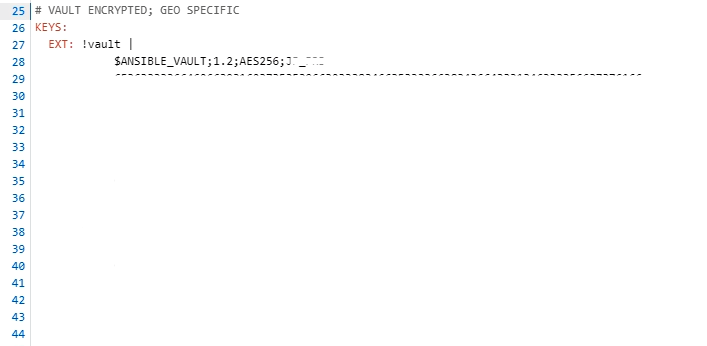

# Ansible

## ansible vault

To encrypt of decrypt a key, with a password

The password is stored in a file called *vault-pass.txt*

Make sure the file is not executable

> chmod a-x vault-pass.txt

So, you'll probably have an ansible variable called key. It is saved in an encrypted format. It's a lot of characters.

To do the test, which ansible would do automatically in a playbook.

1. copy paste the value of the variable in a separate file without the indentation. Starting where it says $ANSIBLE_VAULT.

2. Save it to a file, for example key.txt

> ansible-vault decrypt key.txt --vault-password-file vault-pass.txt

This will convert the file. If you don't want to change it but just prove that you have the correct password and it will work...

> cat key.txt | ansible-vault decrypt /dev/stdin --vault-password-file vault-pass.txt --output=/dev/stderr

Do the opposite and encrypt an existing key

> ansible-vault create --vault-id QA@prompt internal-key.yml

## running a playbook using roles

| steps | comments | 
| - | - |
| ansible.cfg -> inventory = roles/int-inventory/inventory | This line will make sure you reuse an inventory instead of making your own. Then you will have access to all the variables of such inventory in your playbook run. |
| inventory | Make sure to add your hosts in the correct group |
| inventory-repo/host_vars/ | Add files here with VARS Specific to the project I worked on. They will be included automatically in the playbook run |